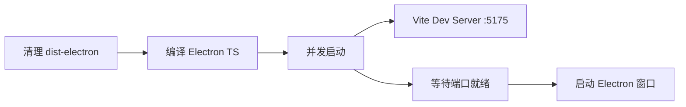

# LobsterAI 开发与构建命令说明

> 本文档基于实际环境验证编写，环境信息：Windows / Node.js v24.13.1 / npm 11.8.0

---

## 1. 项目概述

**LobsterAI** 是一个基于 Electron + React + TypeScript 的全场景个人助理桌面应用，由网易有道开发。

| 维度 | 详情 |
|------|------|
| 框架 | Electron 40 + React 18 + TypeScript |
| 构建工具 | Vite 5 + vite-plugin-electron |
| 样式 | Tailwind CSS |
| 状态管理 | Redux Toolkit |
| 本地存储 | better-sqlite3 (SQLite) |
| Agent 引擎 | OpenClaw (可选，dev/打包时按需构建) |
| 包管理器 | npm |
| 打包工具 | electron-builder |

---

## 2. 环境要求

| 依赖 | 版本要求 | 验证命令 |
|------|---------|----------|
| **Node.js** | >= 24 < 25 | `node --version` |
| **npm** | 内置于 Node.js | `npm --version` |
| **Git** | 任意版本 | `git --version` |
| **Python 3** | (打包 Windows 版需要) | `python --version` |

> **注意**：Windows 打包 (`dist:win`) 需要 Python 运行时，脚本 `setup:python-runtime` 会自动处理。

### 2.1 代理配置（网络受限环境）

如果处于需要代理的网络环境，在执行任何需要外网访问的命令前设置代理环境变量：

```powershell
# PowerShell - 临时设置（当前终端会话有效）
$env:HTTP_PROXY = "http://127.0.0.1:7890"
$env:HTTPS_PROXY = "http://127.0.0.1:7890"
$env:http_proxy = "http://127.0.0.1:7890"
$env:https_proxy = "http://127.0.0.1:7890"

# 同时设置 npm 代理
npm config set proxy http://127.0.0.1:7890
npm config set https-proxy http://127.0.0.1:7890
```

> **说明**：`scripts/setup-python-runtime.js` 中的 `downloadArchive()` 已修改为自动读取 `HTTPS_PROXY`/`HTTP_PROXY` 环境变量，通过 Node.js 内置的 `undici.ProxyAgent` 走代理下载。

代理会影响以下下载操作：
- OpenClaw 插件下载（`openclaw:plugins`）
- Python 运行时下载（`setup-python-runtime`）
- pip.pyz 运行时下载
- electron-builder 的 Electron 二进制下载
- Git 克隆/拉取（需额外配置 `git config http.proxy`）

---

## 3. 依赖安装

### 3.1 首次安装

```bash
# 在项目根目录执行
npm install
```

**安装过程会自动执行：**

| 步骤 | 脚本 | 说明 |
|------|------|------|
| 1 | `npm install` | 安装所有 npm 依赖（约 1590 个包） |
| 2 | `postinstall: patch-package` | 应用 patches 目录下的补丁（本项目当前无补丁） |
| 3 | `postinstall: electron-builder install-app-deps` | 为当前平台重新编译原生模块（better-sqlite3, bufferutil, utf-8-validate） |
| 4 | `prepare: husky` | 初始化 Git hooks（commitlint 等） |

**安装耗时**：约 2-5 分钟（取决于网络状况）

### 3.2 重新安装

```bash
# 清理后重装
rm -rf node_modules
npm install
```

---

## 4. 开发模式

### 4.1 基础开发模式（推荐）

```bash
npm run electron:dev
```

**执行流程：**



**效果：**
- Vite 开发服务器运行在 `http://localhost:5175`
- Electron 窗口自动打开，加载 Vite 开发页面
- 修改 `src/renderer/` 下代码 → Vite HMR 热更新
- 修改 `src/main/` 下代码 → Electron 主进程自动重启

### 4.2 带 OpenClaw 引擎的开发模式

```bash
npm run electron:dev:openclaw
```

首次运行会自动克隆并构建 OpenClaw Agent 引擎到 `../openclaw` 目录（可能需要几分钟）。后续运行若版本未变则自动跳过构建。

**环境变量：**

| 变量 | 说明 | 示例 |
|------|------|------|
| `OPENCLAW_SRC` | 指定 OpenClaw 源码路径 | `OPENCLAW_SRC=/path/to/openclaw` |
| `OPENCLAW_FORCE_BUILD` | 强制重新构建 | `OPENCLAW_FORCE_BUILD=1` |
| `OPENCLAW_SKIP_ENSURE` | 跳过版本检查 | `OPENCLAW_SKIP_ENSURE=1` |
| `KEYFROM` | 渠道标识 | `KEYFROM=xxx` |

```bash
# 示例：指定源码路径并强制重建
OPENCLAW_SRC=D:\code\openclaw OPENCLAW_FORCE_BUILD=1 npm run electron:dev:openclaw

# 示例：渠道包开发模式
KEYFROM=netease npm run electron:dev:openclaw
```

### 4.3 仅启动 Vite 开发服务器（不启动 Electron）

```bash
npm run dev
```

Vite 开发服务器运行在默认端口，可通过浏览器访问进行前端调试。

---

## 5. 代码质量

### 5.1 代码检查

```bash
# ESLint 检查
npm run lint

# 代码格式化检查
npm run format:check

# 自动格式化
npm run format
```

### 5.2 运行测试

```bash
# 运行所有测试（Vitest）
npm test

# 运行指定模块测试
npm test -- logger

# 运行内存提取器测试（Node.js 原生测试）
npm run test:memory
```

---

## 6. 生产构建

### 6.1 编译构建

```bash
# 完整构建（TypeScript 编译 + Vite 打包）
npm run build
```

**构建流程：**

| 步骤 | 命令 | 产出 |
|------|------|------|
| prebuild | `node scripts/generate-keyfrom-build-info.cjs` | 生成渠道标识 |
| tsc | TypeScript 编译 | 类型检查 |
| vite build | Vite 生产打包 | `dist/` 目录 |

**产物目录：**

```
dist/                  # 前端资源（HTML/CSS/JS/图片）
  ├── index.html
  └── assets/
dist-electron/         # Electron 主进程 + preload
  ├── main.js
  └── preload.js
```

### 6.2 单独编译 Electron 主进程

```bash
npm run compile:electron
```

使用 `electron-tsconfig.json` 配置编译 `src/main/`、`src/common/`、`src/shared/` 下的 TypeScript。

### 6.3 构建技能包

```bash
# 构建所有技能
npm run build:skills

# 单独构建
npm run build:skill:web-search   # Web 搜索技能
npm run build:skill:tech-news    # 科技新闻技能
npm run build:skill:email        # 邮件技能
```

---

## 7. 平台打包分发

打包使用 [electron-builder](https://www.electron.build/)，输出到 `release/` 目录。

### 7.1 Windows

```bash
# 完整打包（包含 Python 运行时）
npm run dist:win

# 渠道包
npx cross-env KEYFROM=xxx npm run dist:win
```

输出：`release/LobsterAI Setup x.x.x.exe`（NSIS 安装包）

### 7.2 macOS

```bash
# Apple Silicon (arm64)
npm run dist:mac:arm64

# Intel (x64)
npm run dist:mac:x64

# Universal (双架构)
npm run dist:mac:universal
```

输出：`release/LobsterAI-x.x.x-arm64.dmg` 等

### 7.3 Linux

```bash
npm run dist:linux
```

输出：`release/LobsterAI-x.x.x.AppImage`

### 7.4 仅打包不安装（调试用）

```bash
npm run pack
```

输出：`release/win-unpacked/`（未压缩的目录）

---

## 8. 快速参考卡

```bash
# ========== 环境准备 ==========
npm install                          # 安装依赖

# ========== 开发 ==========
npm run electron:dev                 # 启动开发环境（Vite + Electron 热重载）
npm run electron:dev:openclaw        # 启动开发环境（含 OpenClaw 引擎）
npm run dev                          # 仅启动 Vite 开发服务器

# ========== 代码质量 ==========
npm run lint                         # ESLint 检查
npm run format                       # Prettier 格式化
npm test                             # 运行测试

# ========== 构建 ==========
npm run build                        # 完整生产构建
npm run compile:electron             # 编译 Electron 主进程
npm run build:skills                 # 构建所有技能

# ========== 打包 ==========
npm run dist:win                     # Windows 安装包
npm run dist:mac:arm64               # macOS Apple Silicon
npm run dist:mac:x64                 # macOS Intel
npm run dist:linux                   # Linux AppImage
npm run pack                         # 仅打包不安装（调试用）
```

---

## 9. 项目目录结构

```
ypaction2/
├── src/
│   ├── main/              # Electron 主进程（窗口管理、IPC、SQLite、Agent 引擎路由）
│   │   ├── main.ts        # 入口文件
│   │   ├── sqliteStore.ts # SQLite 数据库
│   │   ├── coworkStore.ts # Cowork 会话存储
│   │   ├── skillManager.ts# 技能管理
│   │   └── im/            # IM 网关（微信/企微/钉钉/飞书/QQ/Telegram/Discord 等）
│   ├── renderer/          # React 渲染进程（UI）
│   │   ├── App.tsx
│   │   ├── components/    # UI 组件
│   │   ├── services/      # 业务逻辑服务
│   │   └── store/         # Redux 状态管理
│   ├── common/            # 主进程公共模块
│   └── shared/            # 主进程/渲染进程共享类型
├── SKILLs/                # 内置技能定义（docx/xlsx/pptx/pdf/web-search 等）
├── scripts/               # 构建脚本（OpenClaw 运行时、打包、图标生成等）
├── resources/             # 资源文件（系统提示词、托盘图标、错误页）
├── build/                 # 构建配置（图标、macOS 权限）
├── dist/                  # 前端构建产物
├── dist-electron/         # Electron 构建产物
├── release/               # 打包输出目录
├── package.json           # 项目配置
├── vite.config.ts         # Vite 配置（含 electron 插件）
├── tsconfig.json          # TypeScript 配置（渲染进程）
├── electron-tsconfig.json # TypeScript 配置（主进程）
└── electron-builder.json  # electron-builder 打包配置
```

---

## 10. 常见问题

### Q: `better-sqlite3` 编译失败？

`postinstall` 脚本会自动安装预编译二进制文件。如果失败，尝试：

```bash
npm rebuild better-sqlite3
```

### Q: Electron 窗口白屏？

确认 Vite 开发服务器正常运行在 `http://localhost:5175`，且 `dist-electron/.electron-ready` 文件已生成。

### Q: 端口 5175 被占用？

修改 `vite.config.ts` 中的 `devPort` 变量，并同步更新 `package.json` 中 `electron:dev` 脚本的端口。

### Q: 如何切换 npm 镜像加速？

```bash
npm config set registry https://registry.npmmirror.com
```

### Q: OpenClaw 构建太慢？

设置环境变量跳过或使用已有构建：

```bash
OPENCLAW_SKIP_ENSURE=1 npm run electron:dev:openclaw
```

### Q: Python 运行时下载卡住或超时？

`scripts/setup-python-runtime.js` 已支持代理。确保设置了代理环境变量后再运行：

```powershell
$env:HTTPS_PROXY = "http://127.0.0.1:7890"
$env:HTTP_PROXY = "http://127.0.0.1:7890"
node scripts/setup-python-runtime.js
```

脚本会自动读取 `HTTPS_PROXY`/`HTTP_PROXY` 并通过 Node.js 内置的 `undici.ProxyAgent` 走代理下载 Python 运行时和 pip 组件。

如果代理不可用，也可以手动下载后通过环境变量指定本地文件：

```powershell
# 手动下载 python-embed zip 到项目根目录
$env:LOBSTERAI_PORTABLE_PYTHON_ARCHIVE = "E:\code\ypaction2\resources\python-win-runtime.zip"
```

### Q: OpenClaw 插件下载失败？

插件通过 OpenClaw CLI 从 npm registry 下载，需要代理：

```powershell
$env:HTTPS_PROXY = "http://127.0.0.1:7890"
npm run openclaw:plugins
```

内网 registry（如 `npm.nie.netease.com`）的插件可能仍需直接网络访问。可选插件（标记 `optional: true`）失败不会阻塞构建。
